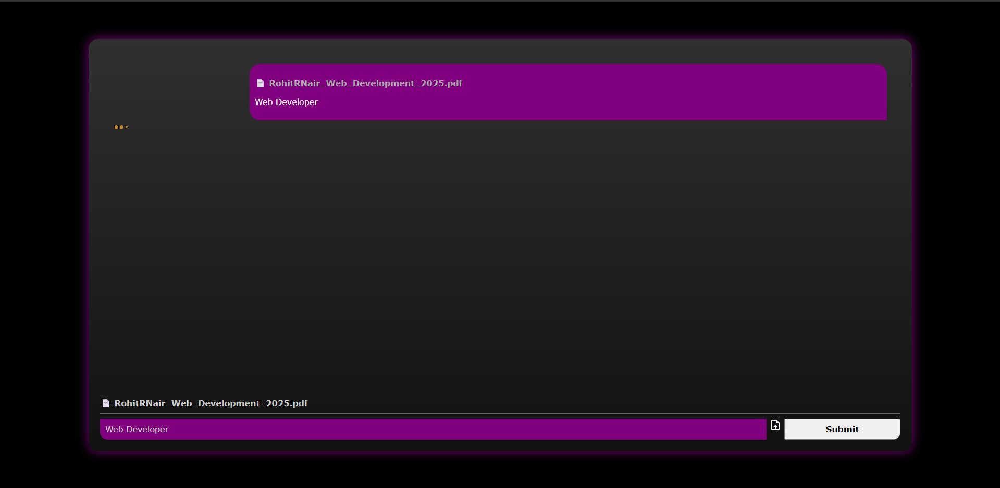

# prepPilot : Resume-to-Interview Questions Generator

A web application that analyzes a user's resume and the job role they've applied for, then generates tailored interview questions using the Gemini API. It separates questions into Technical and Behavioral categories for easy review.

## 🚀 Features

- Upload resume in plain text or PDF
- Enter the target job role
- AI-generated interview questions categorized into:
  - Technical (1–5)
  - Behavioral (6–10)
- Clean formatting without markdown or symbols
- Editable prompts and results
- Gemini API integration
- Scrollable, styled chat-like output

## 📸 Screenshots

### Home Page


### File and Role Upload


### Generated Questions


## 🛠️ Tech Stack

- **Frontend:** React, TailwindCSS
- **AI Model:** Gemini (Google Generative AI API)
- **State Management:** React hooks (`useState`, `useEffect`)
- **File Handling:** HTML file upload, text parsing

  
## 🔧 Setup Instructions

1. **Clone the repo**
```bash
git clone https://github.com/s2kOp/prepPilot.git
cd prepPilot
```

2. **Install dependencies**
```bash
npm install
```

3.**Set your Gemini API key**
Create a .env file in the root folder:
```bash
GEMINI_API_KEY=your_api_key_here
```

4.**Start the development server**
```bash
npm run dev
```
